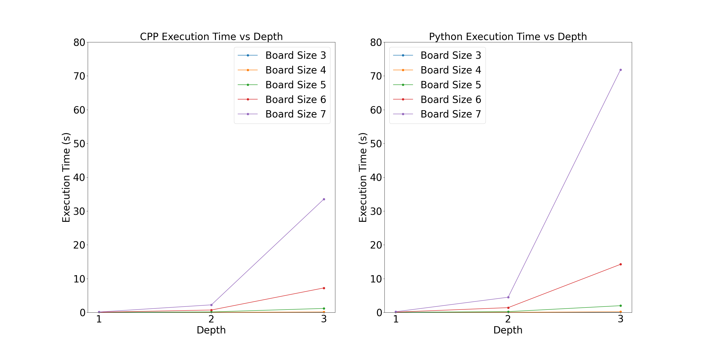

# Dynamic Tic-Tac-Toe Minimax Algorithm

This repository contains implementations of a variable-length Tic-Tac-Toe minimax algorithm in both C++ and Python. The algorithm is capable of playing Tic-Tac-Toe on boards of different sizes and utilizes the minimax algorithm with alpha-beta pruning for decision-making. Additionally, depth limitation is implemented to optimize the search process.

## Files

- `ttt.h`: Header file containing the definition of the Tic-Tac-Toe minimax class in C++.
- `ttt.cpp`: Source file containing the definitions of the functions and methods of the Tic-Tac-Toe minimax class in C++.
- `driver.cpp`: C++ program used to run the minimax algorithm at different sizes of the board and input the time into a CSV file.
- `play.cpp` and `play.out`: C++ programs and executable used to play against the minimax algorithm. Can be used with `play.out <board size> <depth of minimax algorithm>`.
- `ttt.py`: Python script containing the implementation of the Tic-Tac-Toe minimax class in Python.
- `driver.py`: Python script used to run the minimax algorithm at different sizes of the board and input the time into a CSV file.
- `play.py`: Python script used to play against the minimax algorithm. Can be used with `python3 play.py <board size> <depth of minimax algorithm>`.
- `python.csv` and `cpp.csv`: CSV files storing the runtime from the drivers of each in the form: board size, depth, execution time.
- `data_collection.sh`: Shell script that runs the drivers of each program for board sizes 3-10, 10 times each.

## Minimax Algorithm

The minimax algorithm is used to find the best possible move to make. This is done by first choosing who is the minimizing and who is the maximizing player. The maximizing player wants the end value of the game to be as big as possib;e, and the minimzing player want the end value of the game to be as small as possible. If the current state is the maximizing player, then we want to choose the action that has the best chance of resulting in the biggest number. To do this, we explore what will happen if we choose all possible actions. When we explore an action, if the game hasn't ended, we are now the oppenent (minimzing player), so now we choose the best possible action for the minimizing player by exploring all actions they can take. This is done iteratively until we find the value of each action the curent player can take. By assuming the oppenent plays optimally, we can now take the action that will most likely result in the best outcome for the current player. 

Image provided by https://cs50.harvard.edu/ai/2024/notes/0/

- Green is an optimizing player, red is a minimzing player
- The first state has 3 possible actions
- These actions put the state into the opponents turn, the opponent is the minimizing player and when their optimal actions are taken, the end game value is the number within their triangle
- The top state chooses the max of these actions which is 9

## Optimization

If we do this for every possible state in a 3x3 tic tac toe, we would explore around 260,000 outcomes. As the board expands, this gets much larger and will result in very large execution times. To optimize this, I implemented 2 methods that significantly decrease how many states are explored.

1. Alpha-Beta Pruning
    - Reduces the states explored by holding the max value the maximizing player has found (alpha) and the min value the minimzing player has found (beta)
    - If the action being explored will not be better than the value that has been already found, then we stop exploring that action

    -  image provided by https://cs50.harvard.edu/ai/2024/notes/0/
        - In the first action explored (left most minimzing player) the value we get is 4 and will be the current alpha, the next action explored we see that the minimizing player gets a 3, which is less than our alpha 4 and from there the minimzing player would only make the number even lower so we can stop exploring that action because we know there is a better one. The last action explored the minimzing player gets a 2, which is worse than our alpha so we can stop exploring that action.

2. Depth Limited Search
    - Alpha-beta pruning reduces runtime at each state, but there will still be many states to explore. To reduce the amount of states to explore I implemented a depth limited search. Given a certain depth, we explore that many levels down from the current state to determine the best action. By doing this we cannot get the end game value, so we estimate it using some heurstic function. The heuristic I used was the amount of winning oppurtunities available, by finding how many continuous dimension-length openings for a given player there are. The player with most winning oppurtunities is the predicted winner.

## Data Collection and Analysis

The `data_collection.sh` script can be used to collect runtime data for both C++ and Python implementations. The collected data is stored in `python.csv` and `cpp.csv`. The `analysis.ipynb` Jupyter notebook contains code to generate a plot.

## Execution Time vs Depth

