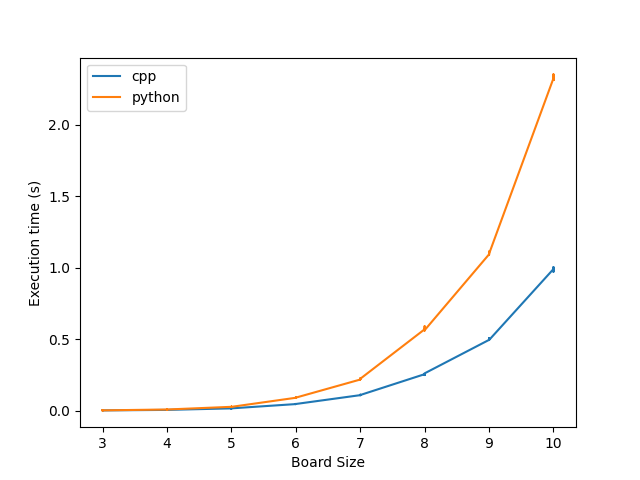

# Dynamic Tic-Tac-Toe Minimax Algorithm

This repository contains implementations of a variable-length Tic-Tac-Toe minimax algorithm in both C++ and Python. The algorithm is capable of playing Tic-Tac-Toe on boards of different sizes and utilizes the minimax algorithm with alpha-beta pruning for decision-making. Additionally, depth limitation is implemented to optimize the search process.

## Files

- `ttt.h`: Header file containing the definition of the Tic-Tac-Toe minimax class in C++.
- `ttt.cpp`: Source file containing the definitions of the functions and methods of the Tic-Tac-Toe minimax class in C++.
- `driver.cpp`: C++ program used to run the minimax algorithm at different sizes of the board and input the time into a CSV file.
- `play.cpp` and `play.out`: C++ programs and executable used to play against the minimax algorithm. Can be used with `play.out <board size> <depth of minimax algorithm>`.
- `ttt.py`: Python script containing the implementation of the Tic-Tac-Toe minimax class in Python.
- `driver.py`: Python script used to run the minimax algorithm at different sizes of the board and input the time into a CSV file.
- `play.py`: Python script used to play against the minimax algorithm. Can be used with `python3 play.py <board size> <depth of minimax algorithm>`.
- `python.csv` and `cpp.csv`: CSV files storing the runtime from the drivers of each in the form: board size, depth, execution time.
- `data_collection.sh`: Shell script that runs the drivers of each program for board sizes 3-10, 10 times each.

## Usage

### C++

To play against the minimax algorithm:

```shell
./play.out <board size> <depth of minimax algorithm>
```
- default board size is 3
- default depth is 10

### Python

To play against the minimax algorithm:

```shell
python3 play.py <board size> <depth of minimax algorithm>
```
- default board size is 3
- default depth is 10

## Data Collection and Analysis

The `data_collection.sh` script can be used to collect runtime data for both C++ and Python implementations. The collected data is stored in `python.csv` and `cpp.csv`. The `analysis.ipynb` Jupyter notebook contains code to generate a plot.

## Plots



The plot shows the execution time and board sizes for both C++ and Python implementations. It illustrates that the execution times are similar for board sizes 3-5, but C++ is much faster afterward

